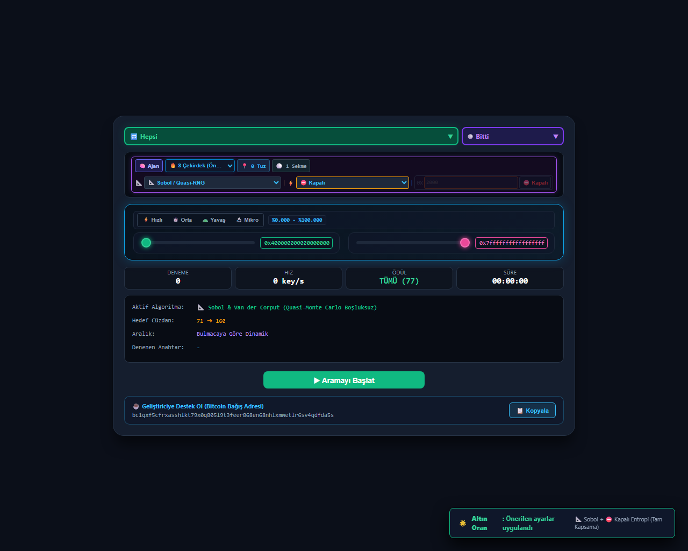

# ⚡ BTC Puzzle Hunter — Single-File Offline Edition (`index.html`)

[](https://github.com/Mucid19/btc-puzzle-hunter)
[](https://mucid19.github.io/btc-puzzle-hunter/)
[](https://bitcoin.org)
[-blue)](#)
[](#)
[](#)
[](LICENSE)



**`index.html`** is an ultra-fast, 100% offline, zero-dependency browser-based cryptographic analysis and search engine designed to solve Bitcoin Puzzle transactions. Runs entirely in your local browser RAM via parallel Web Workers and WebGPU hardware acceleration.

**[TR]** *Bitcoin Puzzle işlemlerini çözmek için geliştirilmiş; %100 bağımsız, sıfır dış bağımlılık (Zero External Dependency) içeren ve doğrudan tarayıcı üzerinden çalışan tek dosyalık (single-file), çift dilli (EN/TR), yüksek performanslı arama ve kriptografik analiz aracı.*

---

## 🌐 Live Demo / Canlı Kullanım (GitHub Pages)

Run directly in your browser with zero installation:  
👉 **[https://mucid19.github.io/btc-puzzle-hunter/](https://mucid19.github.io/btc-puzzle-hunter/)**

---

## ⚡ Highlights & Key Features (English)

### 1. 🦘 Pollard's Kangaroo Engine ($O(\sqrt{N})$)
* Solves elliptic curve discrete logarithm problems in $O(\sqrt{N})$ time complexity instead of exponential brute-force.
* **Hybrid Candidate Verification**: Validates candidate private keys against secp256k1 Hash160 addresses simultaneously while computing elliptic curve trap points.
* Utilizes exposed public keys for known puzzles (#19, #57, #135, #140, #145, #150, #155, #160).

### 2. ⚡ Multi-Thread Web Workers
* Automatically detects your hardware CPU concurrency (`navigator.hardwareConcurrency`).
* Spawns 1 to 32+ independent Web Workers running in parallel with 100% CPU utilization.
* Dynamic cache busting via Blob URLs ensures clean memory allocation on every run.

### 3. 🚀 WebGPU Hardware Acceleration
* Process millions of key combinations per second directly on your graphics card cores using WebGPU (`gpu_engine.js`).

### 4. 🎯 12+ Specialized Search Algorithms
* **🎲 Pure Random**: Cryptographically secure uniform global exploration.
* **📐 Sobol (Quasi-RNG)**: Low-discrepancy space-filling sequence.
* **📏 Van der Corput**: Number-theoretic bit-reversal sequence.
* **🌟 Weyl Golden Ratio ($\phi$)**: Irrational stride lattice for zero overlapping.
* **♾️ Coprime Stride**: Modular non-repeating cycle traversal.
* **🌀 Hilbert Curve**: Multi-dimensional space-filling topological walk.
* **⚡ Weak Entropy**: Targets defective PRNG seeds and low-entropy keys.
* **🌌 Deterministic Chaos**: Logistic and tent map dynamic trajectory.
* **🦘 Pollard's Kangaroo**: Elliptic curve trap and collision network $O(\sqrt{N})$.
* **🎲 Halton Sequence**: Prime-based multi-dimensional uniform coverage.
* **🔀 Scrambled Sobol**: Owen-scrambled dynamic space filling.
* **🎰 MCMC (Markov Chain)**: Adaptive Metropolis-Hastings walk.

### 5. 🌐 Bilingual Interface (EN / TR)
* Instant 1-click language switcher (`🌐 EN | TR`) in the header.
* Fully translated buttons, labels, algorithms, and real-time statistics.

### 6. 🛡️ 100% Air-Gapped & Offline Safe
* Embedded standalone libraries: CryptoJS, secp256k1, BigInteger, Bech32, Base58, and RIPEMD160.
* Zero network requests, zero telemetry, zero analytics.

---

## 🚀 Quick Start

1. Clone or download this repository:
   ```bash
   git clone https://github.com/Mucid19/btc-puzzle-hunter.git
   ```
2. Double-click **`index.html`** in any modern web browser (Chrome, Brave, Edge, Firefox, Safari).
3. Select your target puzzle (#66, #71, #72, etc.), choose your preferred algorithm, adjust thread count, and click **▶ Start Hunting**!

---

## 🌟 Türkçe Özellikler ve Kullanım Rehberi

### 1. Hedef Belirleme
* Sol açılır listeden aramak istediğiniz Bitcoin Puzzle numarasını seçin (örneğin `#66`, `#71`, `#72` vb.).
* Çözülmüş tüm bulmacalar otomatik olarak Arşiv listesinde ayrı tutulur.

### 2. Algoritma ve Donanım Ayarı
* Arama yönteminizi belirleyin (`🔄 Strateji Döngüsü`, `🦘 Kangaroo`, `🎲 Rastgele`, `📐 Sobol`, vb.).
* Donanımınıza uygun iş parçacığı (Worker) sayısını seçin veya WebGPU motorunu etkinleştirin.

### 3. Çoklu Havuz ve Format Desteği
* Üretilen her aday anahtar eşzamanlı olarak hem seçili hedefte hem de **İlave Adres Havuzunda (22.000+ adres)** test edilir.
* Sıkıştırılmış (`1...`, `bc1q...`), sıkıştırılmamış ve Nested SegWit (`3...`) formatları anında taranır.

---

## 📂 Repository File Structure

| File | Description |
| :--- | :--- |
| **`index.html`** | %100 standalone, zero-dependency bilingual web application |
| **`gpu_engine.js`** | WebGPU hardware acceleration engine |
| **`kangaroo_engine.js`** | Pollard's Kangaroo elliptic curve collision library |
| **`all_160_puzzles.json`** | All 160 Bitcoin puzzle target ranges and addresses dataset |
| **`manifest.json`** | PWA (Progressive Web App) installation manifest |
| **`sw.js`** | Offline Service Worker caching |
| **`icon-192.png`** / **`icon-512.png`** | High-resolution PWA application icons |
| **`ui_preview.png`** | Project interface preview image |
| **`LICENSE`** | MIT Open-Source License |
| **`README.md`** | Bilingual project documentation |

---

## ☕ Support & Donations / Bağış

If this project helped you or supported your research, voluntary contributions are warmly appreciated:

### 🪙 Bitcoin (BTC) Donation Address:
```text
bc1qxf5cfrxasshlkt79x0q805l9t3feer868en68nhlxmwetlr6sv4qdfda5s
```

---

## ⚖️ License & Disclaimer

Distributed under the **MIT License**. See `LICENSE` for more information.  
*This software is developed strictly for educational, mathematical research, and cryptographic analysis purposes.*
